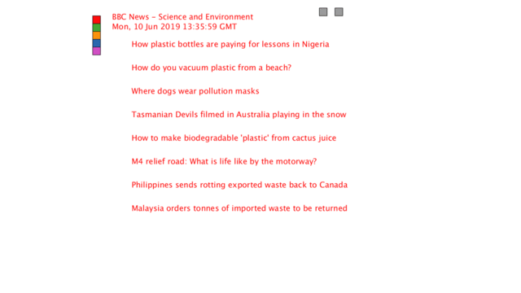

## Description
This program is an RSS reader that contains 5 feeds and directs the user to the desired 
website when an article is clicked. The program loads in 5 different RSS feeds. These are 
updated daily since the program loads in the feeds using the URL's. Each feed is loaded 
into the Feed function which displays them.

## Requirements
- Processing

## How to Use
Open the file named "rss_feed.pde." Click play. If the user hovers over a title, the 
description for that article is displayed at the bottom. If the user clicks on the article, 
the website opens on an internet browser. The left and right buttons at the top of the 
screen allow navigation through the pages of the feed.
